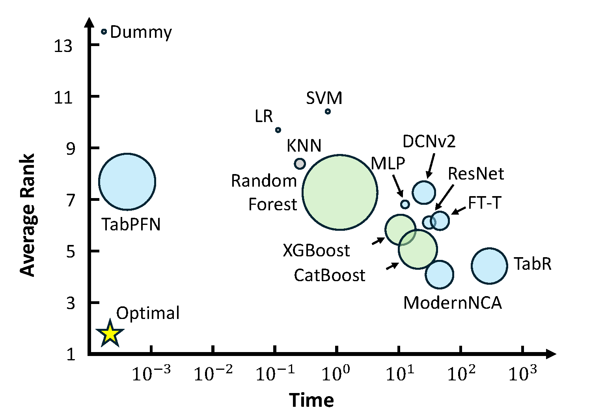
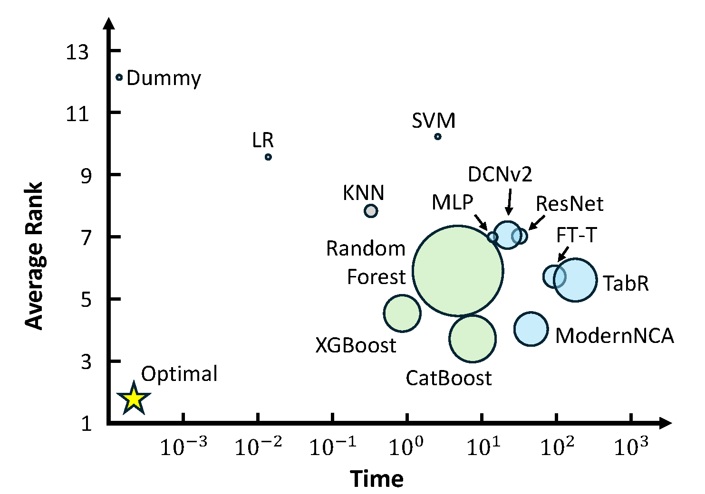
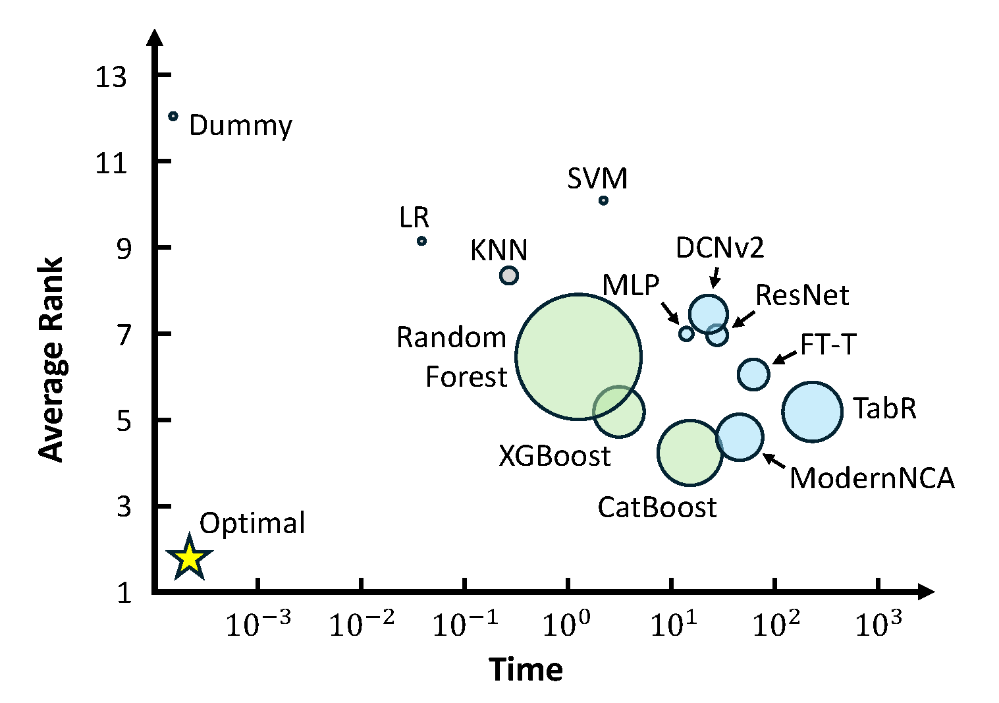

====================================
Experimental Results
====================================

This section presents the experimental results from the TALENT benchmark, which evaluates various classical and deep learning methods on tabular data across multiple tasks, including binary classification, multi-class classification, and regression.

==========================
Evaluation Metrics
==========================

TALENT evaluates the performance of models using the following metrics:

- **Accuracy**: Used for classification tasks (binary and multi-class) to measure the proportion of correct predictions.
- **Root Mean Squared Error (RMSE)**: Used for regression tasks to evaluate the difference between predicted and true values.
- **Efficiency**: Measured as the average training time in seconds. Lower values indicate better time efficiency.
- **Model Complexity**: Indicated by the model size, which is visually represented by the radius of the circles in the result plots. Smaller circles represent simpler models, while larger circles represent more complex models.

==========================
Results Summary
==========================

Below are the summarized results for different task types (binary classification, multi-class classification, and regression) using various models in TALENT. 

The visualizations use average performance rank to compare models, where lower ranks represent better performance across the tasks.

### Binary Classification

The following figure summarizes the performance of different models on binary classification tasks.

.. image:: ../resources/binclass.png
   :width: 600px
   :align: center

### Multi-class Classification

The figure below shows the performance results on multi-class classification tasks.

### Regression

The results for regression tasks are presented in the figure below.

### All Tasks Combined

The following figure represents a combined evaluation of models across all task types (binary classification, multi-class classification, and regression).

These results highlight the strengths and weaknesses of different models, offering insights into which methods are most suitable for various tabular prediction tasks.

==========================
Conclusion
==========================

The experimental results demonstrate that TALENT provides a comprehensive and fair evaluation of both classical and deep learning methods on tabular data. The benchmarks serve as an effective tool for quickly assessing model strengths, weaknesses, and trade-offs between performance and model complexity.

The visualizations presented in this section offer a clear overview of model performance across different tasks, helping practitioners and researchers make informed decisions when selecting models for their specific needs.
